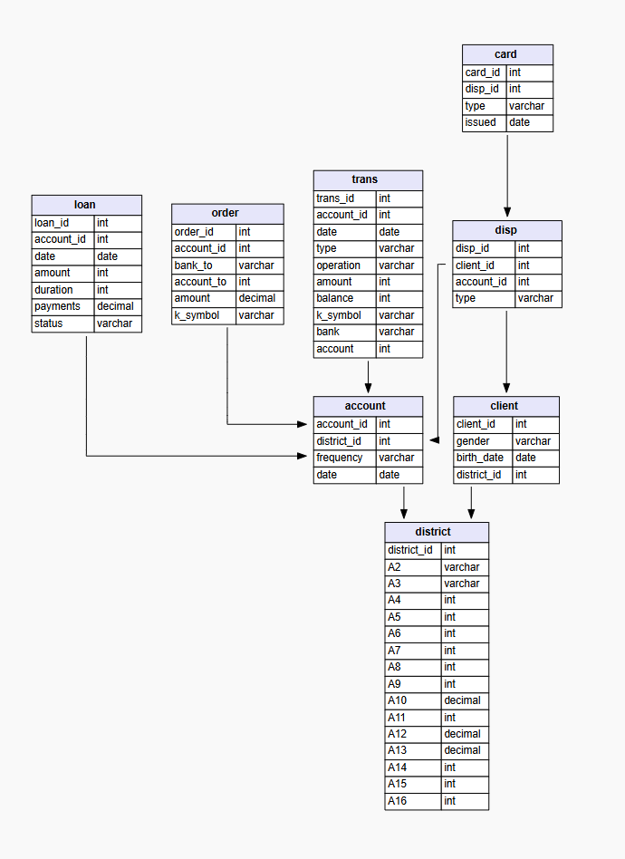

### FinScope Analytics

## Brief project description
FinScope Analytics is a financial analytics company. We study data about clients, accounts, transactions, and loans to find factors that affect whether a loan will be successful or not. The main goal of our analysis is to understand client behavior and help banks better assess credit risks.

## ERD 
